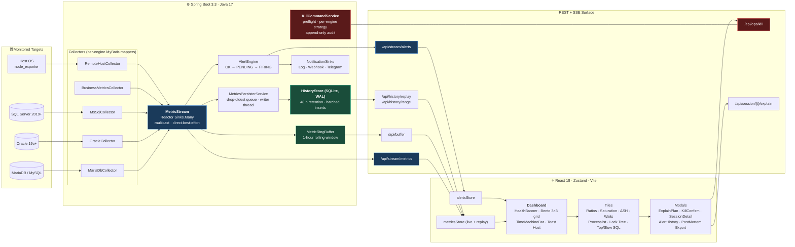

<div align="center">

# DeepGaze

### Agentless, multi-engine database observability — with a time machine.

**One Spring Boot service. Three engines. Zero agents on your DB host.**

*Live streaming telemetry · point-in-time replay · one-click post-mortems · blast-radius-aware kill switch*

[](#)
[](#)
[](#)
[](#)
[](#)
[](#)
[](#license)

</div>

---

## Why DeepGaze

Traditional APM vendors want an agent on every host. Traditional DIY stacks need Prometheus, Grafana, Alertmanager, a time-series database, a dashboard layer, *and* the glue to hold them together.

DeepGaze is the opposite bet: **one process, one fat jar, one SPA**. The backend talks to your databases with the same credentials your DBA already uses. The frontend is a single page you can open on your phone. Everything is alive in ≤ 1 second.

- **Agentless.** Nothing installed on the DB host. DeepGaze reads `performance_schema`, `v$` views, and `sys.dm_*` views through vendor JDBC drivers.
- **Multi-engine parity.** MariaDB, Oracle, and SQL Server emit the same logical snapshot shape, so a single React component renders every target. Add MySQL 8 via the MariaDB family collector.
- **Live.** 1 s collection cadence → Reactor `Flux` multicast → SSE → Zustand store → tile re-render. No Kafka, no external cache, no round-trip polling.
- **Historical.** Embedded SQLite in WAL mode persists 48 h of snapshots at batch-write cost. Scrub the timeline like a VCR and the whole dashboard rewinds with you.
- **Safe by default.** The only write path to your database — killing a runaway session — is gated by a strict engine-specific preflight, a separate ops credential pool, and an append-only audit log.

---

## Screenshots & Demos

> A product this dense deserves to be seen. Drop the referenced assets into [`docs/screenshots/`](docs/screenshots/) and GitHub will render them inline.

### 1. The Bento Dashboard — Light & Dark

A fixed 3×3 grid where every tile keeps its position regardless of engine. The HealthBanner distils the whole system into a single 0–100 score; tiles repaint in place instead of reflowing, so an operator's spatial muscle memory is never broken.

<table>
<tr>
<td></td>
<td></td>
</tr>
<tr>
<td align="center"><em>Dark mode — the default for 24/7 NOC walls.</em></td>
<td align="center"><em>Light mode — readable on meeting-room projectors.</em></td>
</tr>
</table>

### 2. The Time Machine 🕰️ in Action

Drag the scrubber — the *entire* dashboard rewinds. Bento tiles, wait charts, lock tree, processlist, Top / Slow SQL. 48 hours of live snapshots out of a single embedded SQLite file, served by one index seek per group.


> **What to record.** Operator drags the scrubber back ~30 minutes → the Saturation tile flashes red → the Lock Tree populates with a blocking chain → the Ratios tile's Performance Diff chip shows `Live: 99.9% (▼ 15 pp)` so you can *see* the recovery at a glance without leaving replay.

### 3. The Unified Explain Plan Modal

One modal, three planners. Click any row in the Top / Slow Queries tile and DeepGaze runs the engine-native `EXPLAIN` — `EXPLAIN FORMAT=JSON`, `DBMS_XPLAN.DISPLAY_CURSOR('ALLSTATS LAST')`, or `SET SHOWPLAN_XML` — and renders the tree in the same collapsible view. No per-engine UI code.


> **What to record.** A triptych screenshot: MariaDB JSON plan on the left, Oracle `DBMS_XPLAN` cursor plan in the middle, SQL Server `SHOWPLAN_XML` on the right — all in the identical `ExplainPlanView` tree with cost and row estimates highlighted. Demonstrates the per-engine `Map<DbType, ExplainStrategy>` resolving behind one UI.

### 4. Alert-to-Replay → Post-Mortem, in One Flow

The killer workflow. An alert fires → operator clicks it in the history drawer → the dashboard snaps to the exact moment the rule tripped → one button generates a clean Markdown post-mortem and triggers the download.


> **What to record.** Four-beat walkthrough:
> 1. `CRITICAL: session_utilization_pct > 85` arrives in the toast stack.
> 2. Operator opens the Alert History drawer and clicks the offending row.
> 3. The dashboard enters replay at the alert's exact `asOfMs`; every tile repaints to the DB state at that instant; the Time Machine scrubber snaps to the red tick.
> 4. `⤓ Export Post-Mortem` writes `deepgaze-postmortem-stocktrader-db-2026-04-21T03-14-07Z.md` and the browser auto-downloads it.
>
> Captures the *entire* incident-response loop — detect, triage, document — without leaving the page.

---

## Architecture



### Data flow at a glance

1. **Collect.** One `CollectorScheduler` tick per target fires a bundle of mapper queries (`selectSessions`, `selectTopWaits`, `selectBlockers`, `selectRatios`, …) against the target's HikariCP pool. Each result is wrapped as `MetricSnapshot(targetId, type, timestamp, group, rows)`.
2. **Broadcast.** `MetricStream` wraps a Reactor `Sinks.Many` with a dedicated emitter thread (Reactor Rule 1.3). The sink fans out to every downstream consumer.
3. **Buffer + persist.** `MetricRingBuffer` keeps the last hour in-memory for instant SSE backfill. `MetricsPersisterService` enqueues the same frames into a bounded `ArrayBlockingQueue`; a dedicated writer drains into SQLite in 200-frame / 500-ms batches.
4. **React.** Firing `AlertEngine` transitions become `FIRED` / `RESOLVED` events on `/api/stream/alerts`. The frontend stores listen for everything, replay selectors switch data sources seamlessly, and tiles re-render only when their slice changes.

---

## Engines

| Capability | MariaDB 10.5+ / MySQL 8 | Oracle 19c+ | SQL Server 2019+ |
|---|:-:|:-:|:-:|
| Sessions / ASH trend | ✅ `performance_schema.threads` | ✅ `v$active_session_history` | ✅ `sys.dm_exec_requests` |
| Top Waits | ✅ `events_waits_summary_global_by_event_name` | ✅ `v$system_event` | ✅ `sys.dm_os_wait_stats` |
| Blockers / Lock Tree | ✅ `INNODB_LOCK_WAITS` | ✅ `v$lock` | ✅ `sys.dm_tran_locks` |
| Cache / Buffer Ratios | ✅ Buffer Pool Hit % | ✅ Buffer Cache Hit % | ✅ Page Life Expectancy |
| Top / Slow SQL | ✅ `events_statements_summary_by_digest` | ✅ `v$sql` | ✅ `sys.dm_exec_query_stats` |
| **Explain Plan** | ✅ `EXPLAIN FORMAT=JSON` | ✅ `DBMS_XPLAN.DISPLAY_CURSOR` | ✅ `SET SHOWPLAN_XML` |
| **Kill Session** | ✅ `KILL <id>` | ✅ `ALTER SYSTEM KILL SESSION` | ✅ `KILL <spid>` |
| Session Saturation | ✅ derived | ✅ derived | ✅ derived |

One shape of JSON per metric group means a single set of React components handles all three engines — no per-engine UI code.

---

## Feature tour

### The Bento Dashboard

A fixed 3 × 3 `grid-template-areas` layout where every tile keeps its identity regardless of engine. Empty, loading, and *not-supported-on-this-engine* states render in-place skeletons — the operator's spatial muscle memory is never broken.

```
┌─────────────┬─────────────┬─────────────┐
│ Business KPIs│   Ratios    │  Saturation │
├─────────────┼─────────────┼─────────────┤
│   ASH       │  Top Waits  │ Infra Hub   │
├─────────────┼─────────────┼─────────────┤
│ Processlist │  Lock Tree  │  Top / Slow │
└─────────────┴─────────────┴─────────────┘
```

At the top, a **HealthBanner** distils everything into a 0–100 score with a 🟢 / 🟡 / 🔴 badge and the top three reasons, so a PM glancing at the screen knows "is prod OK?" without decoding metrics. Jargon-heavy labels carry plain-English tooltips (*"Page Life Expectancy: seconds data pages stay cached. ≥ 300s healthy; ≤ 100s indicates memory pressure."*).

Fully responsive: collapses to 2 columns on tablets and a single scrollable stack on phones. The Time Machine scrubber gets 48 px tap targets on touch devices.

### The Time Machine 🕰️

DeepGaze keeps **48 hours of live snapshots** in an embedded SQLite database (WAL mode, `synchronous=NORMAL`, `busy_timeout=5000ms`). Drag the timeline scrubber at the bottom of the dashboard and the *entire dashboard* rewinds — bento tiles, wait charts, lock tree, processlist, everything. Point-in-time by `group_key`, fetched over a single index seek.

```
GET /api/history/range?targetId=X           → { rangeMinMs, rangeMaxMs, hasData }
GET /api/history/replay?targetId=X&asOfMs=Y → { snapshots: [MetricSnapshot] }
```

**Alert-to-Replay bridge.** Click any past alert in the history drawer — the dashboard auto-switches targets if needed, enters replay mode at that alert's exact timestamp, and every tile repaints to the DB state at the moment the rule fired. One-click post-mortems.

**Performance Diff.** While replaying, the `Ratios` and `Saturation` tiles quietly fetch the latest live snapshot in the background and render a diff chip: `Live: 99.9% (▼ 15 pp)`. Instantly see whether the incident has recovered without leaving replay.

**Export Post-Mortem.** One click writes a clean Markdown report — header with timestamp and target, firing alerts, preceding transitions, saturation, ratios, top waits, top/slow SQL, and the lock tree rendered as nested bullets — and triggers a browser download. Renders cleanly in GitHub / Notion / Obsidian.

### Explain Plan — the diagnostic weapon

Every engine's query planner speaks a different language. DeepGaze normalises them behind a `Map<DbType, ExplainStrategy>`:

| Engine | Strategy | Format |
|---|---|---|
| MariaDB / MySQL | `MariaDbExplainStrategy` | `EXPLAIN FORMAT=JSON` |
| Oracle | `OracleExplainStrategy` | `DBMS_XPLAN.DISPLAY_CURSOR(sql_id, child_num, 'ALLSTATS LAST')` |
| SQL Server | `MsSqlExplainStrategy` | `SET SHOWPLAN_XML ON` |

Click any row in the `Top / Slow Queries` tile → the `ExplainModal` opens, captures the plan via `SessionDetailService`, and renders it as a collapsible tree (`ExplainPlanView`). Cost estimates, row estimates, operator types — all served from the same read-only monitoring pool. No extra credentials. No plan cache pollution (Oracle uses the child number of the already-cached cursor).

### Circuit Breaker — three layers of timeout

A hung target must never hold a worker thread. DeepGaze enforces three independent cutoffs:

| Layer | Knob | What it catches |
|---|---|---|
| **TCP / socket** | `network.tcpConnectTimeoutMs`, `socketReadTimeoutMs` | Silent NAT/firewall blackholes; half-open connections |
| **Hikari wait** | `hikari.connectionTimeoutMs` | Pool exhausted under load |
| **Per-statement** | `scheduler.collection-timeout-ms` + JDBC `setQueryTimeout` | Slow query on a healthy connection |

Set at the `target:` level in [application.yml](backend/src/main/resources/application.yml). Defaults are conservative (5 s / 8 s / 5 s) — one sick target cannot fan out to stall the rest. The `CollectorScheduler` wraps every tick in `CompletableFuture.orTimeout(…)` as the final backstop.

### Kill Switch — the only write path

The single place where DeepGaze ever mutates your database is [`KillCommandService`](backend/src/main/java/com/deepgaze/ops/KillCommandService.java). The flow is deliberately paranoid:

```
UI (KillConfirmModal)
  → POST /api/ops/kill  [guarded by OpsAuthFilter]
  → KillCommandService.kill(targetId, threadId, principal)
      1. resolve target  (else → REJECTED)
      2. resolve engine strategy  (else → UNAVAILABLE)
      3. resolve OPS datasource  (separate credential pool)
      4. strategy.lookup()   — does the session even exist? → gone
      5. strategy.preflight() — monitoring user? ops user? protected command?
      6. strategy.kill()      — engine-specific (KILL / ALTER SYSTEM KILL / KILL spid)
      7. AUDIT.info(structured one-liner to com.deepgaze.ops.audit)
```

- **Separate pool, separate credentials.** `OpsDataSourceRegistry` only initialises for targets that define `ops-username`/`ops-password`. The monitoring user cannot kill anything.
- **Preflight by engine.** `MariaDbKillStrategy`, `OracleKillStrategy`, `MsSqlKillStrategy` each enforce engine-specific invariants (Oracle needs `SID,SERIAL#`; SQL Server refuses system SPIDs; MariaDB rejects replication threads).
- **Audit as a first-class artefact.** `com.deepgaze.ops.audit` is a dedicated SLF4J logger — point your logback config at a separate file and ingest into SIEM. One structured line per call (`result=ok|rejected|unavailable|failed|gone`) with duration, principal, and captured session metadata.

The UI's `KillConfirmModal` shows the full session row (user, host, SQL snippet, run-time) before the operator confirms. Nothing is killed blind.

### Alert Engine

A declarative state machine. Rules in YAML, state per `(ruleId, targetId)`, live on SSE.

```
                   predicate true      predicate true AND
                                       (now - pendingSince) ≥ for-seconds
   OK ─────────▶ PENDING ───────────────────────────────────────▶ FIRING
    ▲              │                                                │
    │              │  predicate false                               │ predicate false
    └──────────────┴────────────────────────────────────────────────┘
```

- `FIRED` events emit on `PENDING → FIRING` (or direct `OK → FIRING` when `for-seconds: 0`).
- `RESOLVED` events emit on `FIRING → OK`.
- Two row-shape modes: **key-value** (`{variable_name, value}`) for SHOW-STATUS-style data, and **direct-column** for wide rows with an optional `label:` selector to pin to a specific mount / device / volume.
- Pluggable delivery. `LogSink` always active; `WebhookSink` posts JSON; when `chat-id` is set the payload is Telegram-shaped.

### Remote host observability

`RemoteHostCollector` scrapes Prometheus text format from `node_exporter` on the DB host every 2 s. A ~10-metric allowlist is enforced *at parse time* (~990 of node_exporter's 1000 samples are dropped before they touch a map). Deltas for counter metrics are maintained per-target. When every target has a `host-exporter-url`, the in-process OSHI collector doesn't even start.

The output projects into the same `hostCpu` / `hostMemory` / `hostDisk` / `hostFilesystem` groups the frontend already renders — zero frontend changes to go remote.

---

## Quickstart

### Prerequisites

- **Java 17+**
- **Node.js 18+**
- A reachable target DB with a **read-only monitoring user**

### 1. Configure a target

Edit [backend/src/main/resources/application.yml](backend/src/main/resources/application.yml):

```yaml
deepgaze:
  targets:
    - id: stocktrader-db
      type: MARIADB
      jdbc-url: jdbc:mariadb://192.168.0.71:3336/stocktrader_db
      username: monitor_ro
      password: ${MARIA_PWD}
      # Optional — only needed if you want the Kill Switch for this target.
      ops-username: ops_kill
      ops-password: ${MARIA_OPS_PWD}
      # Optional — V4 host-level observability via node_exporter.
      host-exporter-url: http://192.168.0.71:9100/metrics

  history:
    enabled: true
    db-path: ./data/deepgaze-history.db
    retention-hours: 48
    batch-size: 200
    batch-interval-ms: 500
    queue-capacity: 10000

  alerts:
    rules:
      - id: db-session-high
        target: stocktrader-db
        group: dbSaturation
        metric: session_utilization_pct
        op: GT
        threshold: 85
        for-seconds: 60
        severity: CRITICAL

  business-metrics:
    - id: active-sessions
      target: stocktrader-db
      label: Active Sessions
      sql: SELECT COUNT(*) FROM information_schema.processlist WHERE COMMAND <> 'Sleep'
      poll-interval-ms: 2000
      format: integer
```

Secrets come from the environment or from a git-ignored `backend/application-local.yml`.

### 2. Run the backend

```bash
cd backend
./gradlew bootRun
```

The API comes up on `:8080`:

| Endpoint | Purpose |
|---|---|
| `GET /api/stream/metrics` | SSE of `MetricSnapshot` events |
| `GET /api/stream/alerts` | SSE of `AlertEvent` transitions (FIRED / RESOLVED) |
| `GET /api/buffer` | Ring-buffer backfill on connect |
| `GET /api/alerts/firing` | Snapshot of currently firing alerts |
| `GET /api/history/range?targetId=X` | Available replay window for a target |
| `GET /api/history/replay?targetId=X&timestampMs=Y` | Point-in-time snapshot per group |
| `GET /api/session/{targetId}/{pid}` | Session drill-down + EXPLAIN plan |
| `POST /api/ops/kill` | Kill Switch (requires `X-DeepGaze-Ops-Token` header) |
| `GET /actuator/health` | Liveness |

### 3. Run the frontend

```bash
cd frontend
npm install
npm run dev
```

Open `http://localhost:5173`. Vite proxies `/api/*` to `:8080`.

---

## Configuration reference

Everything is bound to `DeepGazeProperties`. See [application.yml](backend/src/main/resources/application.yml) for inline documentation. Highlights:

| Path | Purpose |
|---|---|
| `deepgaze.targets[]` | Database targets (id / type / jdbc-url / credentials) |
| `deepgaze.targets[].hikari.*` | Per-target pool sizing |
| `deepgaze.targets[].network.*` | Driver-level TCP / socket timeouts |
| `deepgaze.targets[].host-exporter-url` | Remote `node_exporter` URL |
| `deepgaze.targets[].ops-username` / `ops-password` | Separate credentials for Kill Switch (optional) |
| `deepgaze.buffer.capacity` | Ring-buffer size (default 35 000 ≈ 1 h × 1 target × 8 groups) |
| `deepgaze.scheduler.worker-pool-size` | Concurrent collections in flight |
| `deepgaze.scheduler.collection-timeout-ms` | Per-tick ceiling (`CompletableFuture.orTimeout`) |
| `deepgaze.history.*` | SQLite Time Machine knobs (retention, batch size, queue capacity) |
| `deepgaze.alerts.rules[]` | Declarative threshold rules |
| `deepgaze.alerts.webhooks[]` | HTTP notification sinks |
| `deepgaze.business-metrics[]` | KPI cards for the top strip |

---

## Build & deploy

```bash
cd backend  && ./gradlew bootJar      # → backend/build/libs/deepgaze-backend.jar
cd frontend && npm run build          # → frontend/dist/
```

The backend is a single fat jar. Run behind any TLS-terminating reverse proxy — the SSE endpoints need the proxy to be streaming-friendly:

- **nginx**: `proxy_buffering off;` and `add_header X-Accel-Buffering no;`
- **Caddy / Traefik / Cloudflare**: disable response buffering on `/api/stream/*` paths
- **Docker**: the backend works fine behind `JAVA_TOOL_OPTIONS=-XX:MaxRAMPercentage=75` with a 512 MB limit for ~10 targets

The SQLite history database is a single file — include `./data/deepgaze-history.db` in your volume mount (and its `-wal` / `-shm` sidecars).

---

## Project layout

```
backend/
  src/main/java/com/deepgaze/
    collector/       # per-engine MyBatis collectors + Prometheus parser
    stream/          # MetricStream, ReactiveMetricBroadcaster
    queue/           # MetricRingBuffer
    alert/           # AlertEngine, rules, sinks
    history/         # HistoryStore (SQLite WAL), MetricsPersisterService
    ops/             # KillCommandService + per-engine KillStrategy
    session/         # SessionDetailService + per-engine ExplainStrategy
    api/             # REST + SSE controllers
    config/          # DataSourceRegistry, HikariPoolFactory, CORS, props
  src/main/resources/
    application.yml  # the single source of truth for runtime config

frontend/
  src/
    api/             # SSE connection wrappers + fetch helpers
    store/           # Zustand: metricsStore (+ replay), alertsStore
    hooks/           # useMetricStream, useAlertStream
    components/      # Dashboard, HealthBanner, TimeMachineBar, Bento tiles,
                     # AlertHistoryPanel, ExplainModal, KillConfirmModal, …
    lib/             # rowAccess, metricGlossary, postmortem
```

---

## License

MIT.
